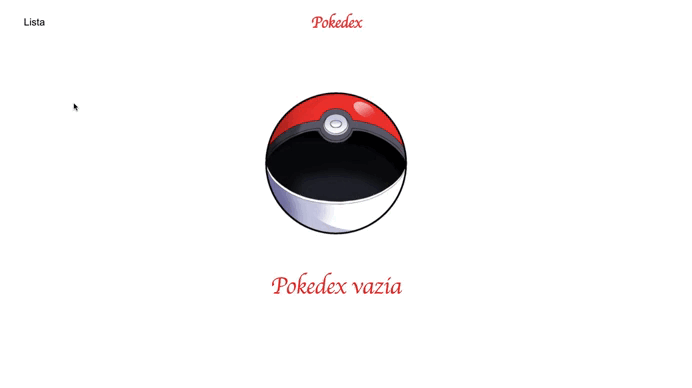

 

<h1 align="center">Pokedex</h1>

 <ul >
  <li><a href="#objetivo">Objetivo</a></li>
  <li><a href="#tec"> 🛠  Tecnologias</a></li>
  <li><a href="#autor">✏️ Autor</a></li>
  <li><a href="#web">🎨 Layout</a></li>
 </ul>

<h1>💻  Sobre o projeto</h1>

 Como muitas outras crianças eu cresci assistindo pokemon e sonhando em montar minha própria pokedex, então já crescido resolvi criar a minha, nesse projeto usei a conhecida PokéAPI, e ainda usei esse projeto para aprender mais sobre Swr e outras ferramentas de desenvolvimento.

<h1 id = 'tec'>🛠 Tecnologias </h1
  
<ul>
  <li>React Router</li>
  <li>styled-components</li>
  <li>axios</li>
  <li>material-UI</li>
  <li>Swr</li>
</ul> 

<h1>Status do Projeto</h1>

<h4>finalizado ✅ </h4>

<h1 id = 'Web'>🎨 Layout</h1>
<h3>WEB</h3>

 

<h1>🚀  Como executar o projeto</h1>

Pré-requisitos:

Antes de começar, você vai precisar ter instalado em sua máquina as seguintes ferramentas: Git, Node.js. Além disto é bom ter um editor para trabalhar com o código como VSCode

<h1>🧭 Rodando a aplicação web (Frontend)</h1>

<h3>Instale as dependências</h3>

\$ npm install

<h3>Execute a aplicação em modo de desenvolvimento</h3>

\$ npm run start

O servidor inciará na porta:3000 - acesse <http://localhost:3000>

<h1 id = 'autor'>✏️ Autor</h1>

                                                                                                              
<a href="https://github.com/Duartemurilo">duarte Murilo 🌐</a></td>
                                                      
                                                      

